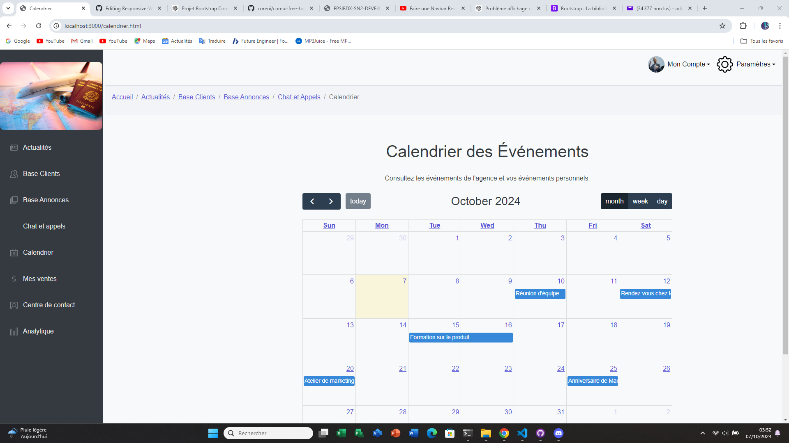
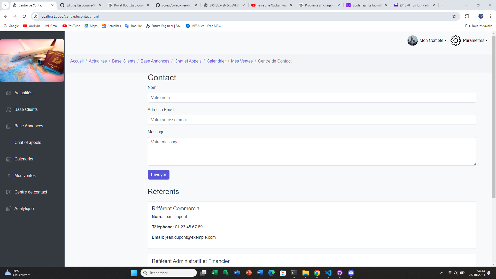
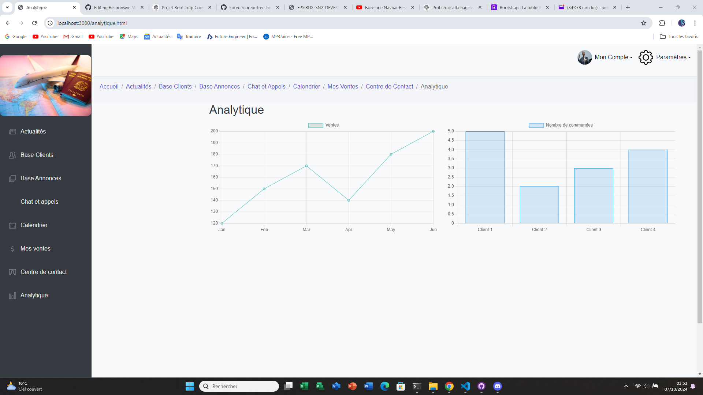

# Responsive-Web
**IMPORTANT** : 
Le projet n'est pas beau visuel
### Page d'accueil

### Base Clients

### Base Annonces

### Chat Et Appels

### Calendriers

### Mes Ventes

### Page de Contact

### Analytiques



## Liste des Pages Maquetées

- `login.html` : Page de connexion.
- `recovery.html` : récuperation de mot de passe
- `ventes.html` : Page de gestion des ventes.
- `actualités.html` : Page d'actualités.
- `basclients.html` : Page de la base des clients.
- `baseannonces.html` : Page de la base des annonces.
- `chatappels.html` : Page de chat et d'appels.
- `calendrier.html` : Page de calendrier.
- `centredecontact.html` : Page du centre de contact.
- `Analytique.html` : Page d'analytique.
- `home.html` : page d'accueil.

  coreui-free-bootstrap-admin-template-main/
├── src/  
│   └── views/
│       ├─404.html /
│       ├──500.html/
│       ├── blank.html/
│       ├── charts.html/
│       ├── color.html/
│       ├── index.html
│       ├── login.html
│       ├── register.html
│       ├── typography.html
│       ├── widgets.html
│       ├── baseannonces.html
│       ├── recovery.html
│       ├── analytique.html
│       ├── centredecontact.html
│       ├── ventes.html
│       ├── calendrier.html
│       ├── chatappels.html
│       ├── actualités.html
│       ├── basclients.html
│       ├── home.html
  └── package.json

### Installation et Démarrage

#### Prérequis

- Un navigateur web moderne (Chrome, Firefox, etc.)
- Optionnel : Un serveur web local (comme Live Server pour Visual Studio Code).

##### Instructions d'Installation


1. **Clonez le dépôt** :
   ```bash
   git clone https://github.com/Adilovic48/Responsive-Web.git

2. **Accédez au dossier du projet** :
   ```bash
   cd Responsive-Web

4. **Installer les dépendances** :
   ```bash
   npm install

4.**Démarrer le serveur** :
   ```bash
      npm start


